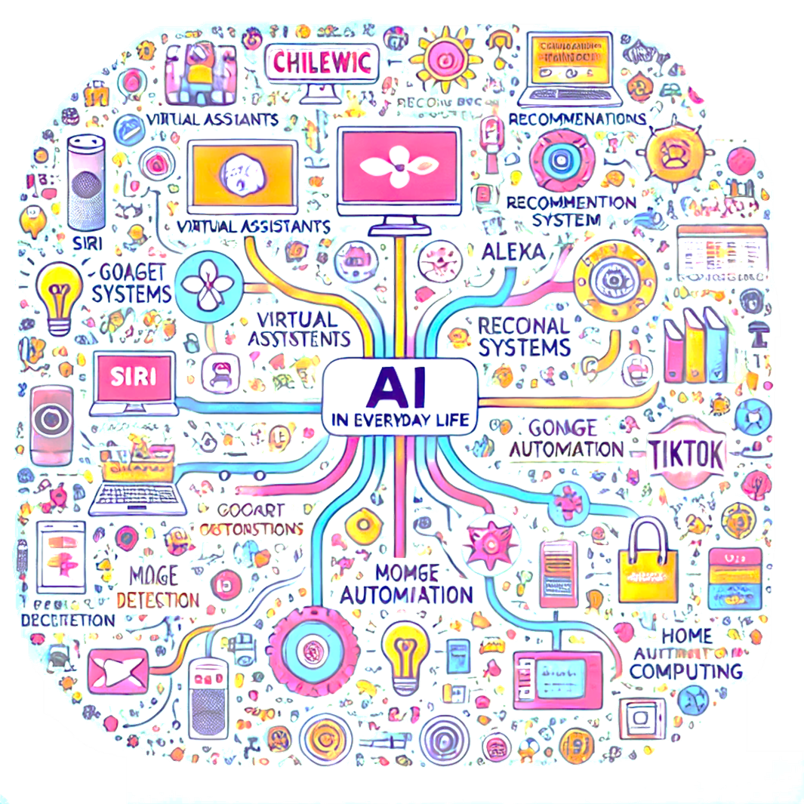
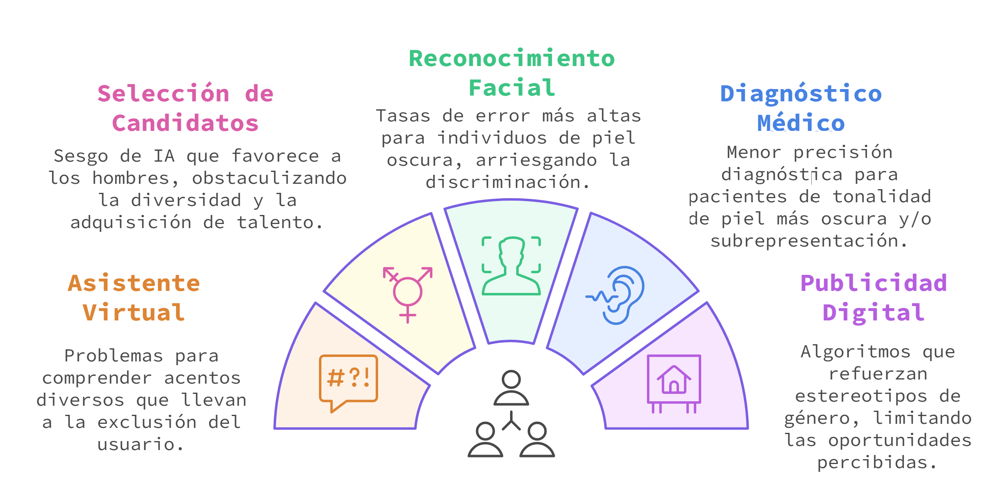
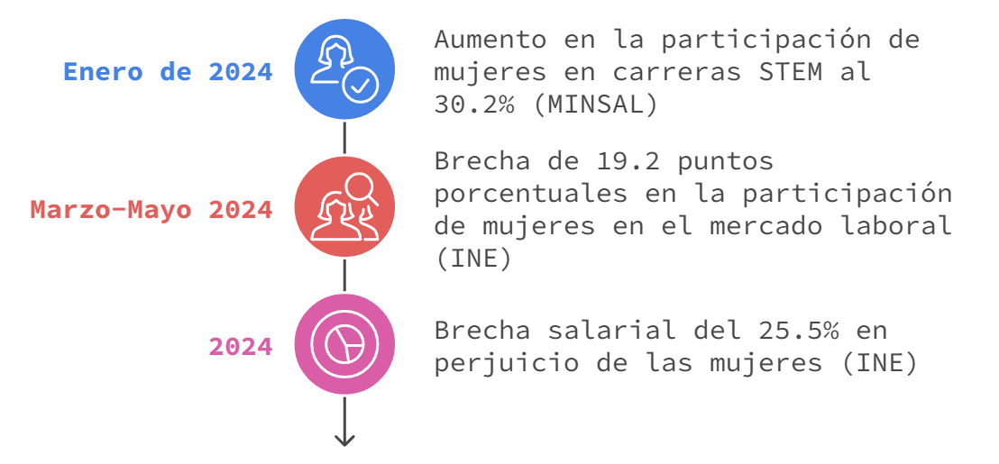
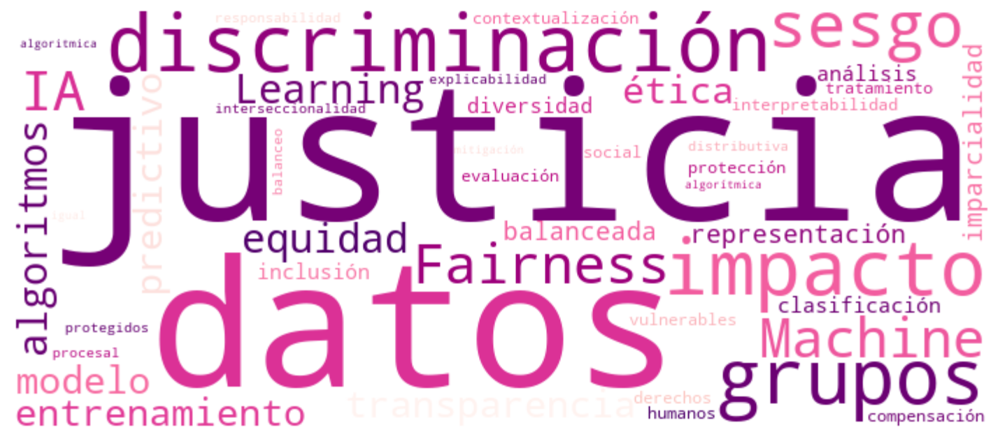
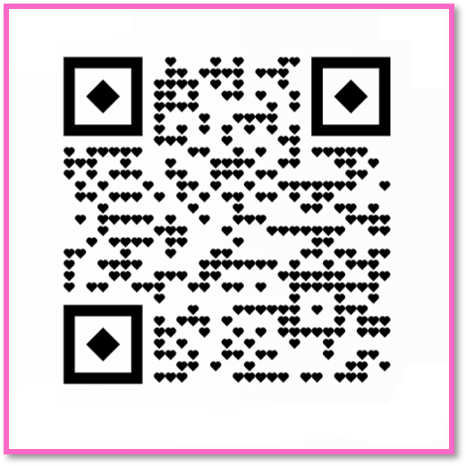
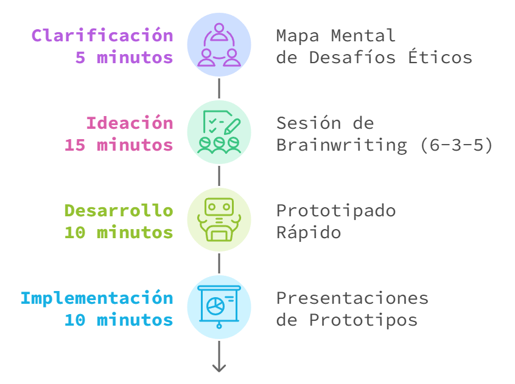
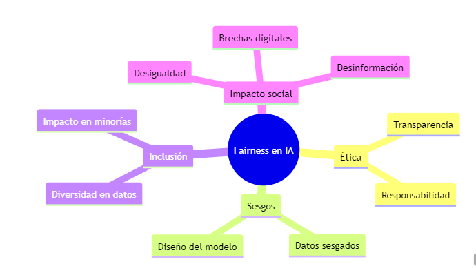
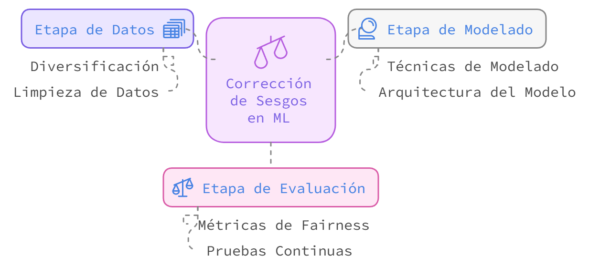

# Taller de Ética y Fairness en IA-ML
## Un Caso de Sesgo de Selección

**Autora:** Cinthya Vergara - Universidad Adolfo Ibáñez  
**Evento:** ChileWiC 2024 - XII Encuentro de Mujeres en Computación  
**Fecha:** 29 de noviembre de 2024

---

# IA, Ética y Fairness

## Actividades

- 🤖 Inteligencia Artificial en la actualidad
- 🤝 Fairness, Inclusión, Ética, Sesgos
- 🧠 *Pensando en grupo*: ¿Cómo resolvemos los sesgos?
- 🎯 Desafíos en el modelamiento de AI-ML
- 💬 Cierre y Conversación

---

## Ética y *fairness* en AI-ML

- **¿Qué es "fairness" en IA-ML?**
  - Problemas comunes: sesgos, discriminación, falta de transparencia.

### Fairness

- Se traduce al español como *equidad* o *imparcialidad*. 
- En el contexto de la inteligencia artificial y el aprendizaje automático, se refiere a la **capacidad de un sistema o modelo para tratar de manera justa y sin sesgo a todos los individuos o grupos, sin discriminación ni prejuicio**.

---

## Sesgos en IA: Un Desafío de Diversidad e Inclusión

---

## Caso: Algoritmo de Contratación

### AMAZON (2014)

- Automatización de selección de CV para puestos técnicos
- Aprendió patrones de éxito basados en datos históricos
- Penalizaba cv que incluían la palabra "femenino", como en "capitana de club de ajedrez femenino".
- Rebajó puntaje de graduadas en dos universidades exclusivas de mujeres

### ¿Podría pasar en Chile?

---

## Ejemplo Interactivo

### Modelo de Contratación Sesgado

Con base en datos chilenos se generaron datos sintéticos para probar distintas estrategias usando un modelo de *Regresión Logística*.

### Descripción Set de Datos

| Variable | Media | Desv. Est. | Mín | Máx / Top |
|:---------|------:|-----------:|----:|----------:|
| Edad | 33.45 | 5.33 | 18 | 54 |
| Genero | --- | --- | --- | Hombre |
| NivelEducativo | --- | --- | --- | Universitario |
| RamaPrincipal | --- | --- | --- | Desarrollo |
| AñosExperiencia | 9.72 | 2.91 | 0 | 20 |
| AñosExperienciaPro | 5.16 | 3.17 | 0 | 16 |
| HaTrabajadoCon | --- | --- | --- | Angular |
| PuntajesTecnologias | 13.74 | 7.62 | 1 | 38 |
| HabilidadesComputacionales | 4.06 | 1.47 | 1 | 10 |
| SalarioAnterior | 2.34MM | 1.13MM | 0.50MM | 9.61MM |
| Puntaje | 2.28 | 1.02 | 0.36 | 9.73 |
| Contratacion | 0.65 | 0.48 | 0 | 1 |

---

## Simulación de Modelo Predictivo Base

El modelo base muestra un refuerzo del sesgo en la selección por iteración, con diferencias significativas en las tasas de selección entre grupos de género.

---

## Pregunta clave

### ¿Cómo podemos crear sistemas de IA más justos?

---

# Inicio del Taller

## Objetivos del taller

- 📚 Analizaremos implicaciones éticas y de equidad
- 🔄 Desarrollaremos soluciones creativas
- 🔍 Identificaremos oportunidades y desafíos en IA

---

## Actividad en Grupos: Análisis del Caso

1. Identificar fuentes de sesgo en los datos
2. Analizar por qué el modelo amplifica estos sesgos
3. Proponer soluciones para mitigar el sesgo

---

# Discusión y Cierre del Taller

## Simulación Caso Fairness

### Bootstrap:
- Realiza 100 iteraciones de remuestreo
- Cada iteración genera una muestra aleatoria del dataset original
- Permite obtener estimaciones más robustas y estimar la variabilidad

### Preprocesamiento:
- Escala características numéricas con StandardScaler
- Codifica características categóricas con OneHotEncoder

### Evaluación:
- Evalúa rendimiento y fairness para cada grupo sensible
- Calcula métricas promedio y su desviación estándar

### Salida del Análisis:
- Métricas promedio por grupo
- Disparidades entre grupos
- Variabilidad de las métricas

---

## Comparación Modelos (3 estrategias)

| Métrica | **BASE** | **SIN_GENERO** | **ATENUADO** |
|---------|----------|----------------|--------------|
| **Accuracy (Hombres)** | 0.937 ± 0.004 | 0.935 ± 0.004 | 0.929 ± 0.005 |
| **Accuracy (No Binarios)** | 0.920 ± 0.019 | 0.909 ± 0.021 | 0.905 ± 0.020 |
| **Accuracy (Mujeres)** | 0.925 ± 0.006 | 0.925 ± 0.007 | 0.915 ± 0.007 |
| **FPR (Hombres)** | 0.135 ± 0.010 | 0.127 ± 0.010 | 0.091 ± 0.009 |
| **FPR (No Binarios)** | 0.073 ± 0.018 | 0.124 ± 0.031 | 0.044 ± 0.017 |
| **FPR (Mujeres)** | 0.068 ± 0.007 | 0.070 ± 0.007 | 0.045 ± 0.005 |
| **TPR (Hombres)** | 0.960 ± 0.003 | 0.955 ± 0.003 | 0.936 ± 0.005 |
| **TPR (No Binarios)** | 0.909 ± 0.033 | 0.955 ± 0.022 | 0.832 ± 0.042 |
| **TPR (Mujeres)** | 0.919 ± 0.009 | 0.920 ± 0.009 | 0.872 ± 0.012 |
| **Tasa de Selección (Hombres)** | 0.755 ± 0.008 | 0.749 ± 0.007 | 0.725 ± 0.008 |
| **Tasa de Selección (No Binarios)** | 0.422 ± 0.037 | 0.471 ± 0.034 | 0.374 ± 0.041 |
| **Tasa de Selección (Mujeres)** | 0.479 ± 0.015 | 0.480 ± 0.014 | 0.444 ± 0.014 |

---

## Resultados globales por modelo

| Modelo | Diferencia en Accuracy | Diferencia en Tasa de Selección | Disparidad FPR |
|--------|------------------------|----------------------------------|----------------|
| Base | 0.016 | 0.332 | 0.066 |
| Sin género | 0.026 | 0.278 | 0.057 |
| Atenuado | 0.019 | 0.327 | 0.039 |

---

## Principales Resultados

- La precisión (accuracy) más alta se observa en el modelo BASE, especialmente para el grupo de hombres (0.937 ± 0.004).
- El **modelo Atenuado** es el que presenta mejor balance entre precisión y reducción de disparidades, especialmente en términos de **FPR** y **TPR**. 
- Si bien existe un pequeño costo en **accuracy**, considerar **fairness** genera mejoras, especialmente en la equidad de género o grupos minoritarios.

### Desafíos Persistentes:
- **Ningún modelo** elimina completamente las disparidades
- Datos reflejan **sesgos estructurales/sistémicos**

---

## Indicadores y Estrategias

### Estrategias Genéricas

---

## Indicadores de Fairness

| **Indicador** | **Descripción** | **Fórmula** |
|---------------|-----------------|-------------|
| **Calibration** | Asegura que las probabilidades predichas por el modelo coincidan con las probabilidades reales de un evento, desglosadas por grupo. | Si un modelo predice una probabilidad $p = 0.8$, entonces aproximadamente el 80% de las instancias deberían ser positivas. |
| **Treatment Equality** | Mide si la probabilidad de que se haga una predicción positiva es igual para todos los grupos. | $P(\hat{y} = 1 \| A = a) = P(\hat{y} = 1 \| A = b)$, donde $a$ y $b$ son distintos valores del atributo sensible $A$. |
| **Fairness Through Unawareness** | Se asegura de que el modelo no utilice explícitamente variables sensibles para hacer predicciones. | El modelo no utiliza explícitamente las variables sensibles, pero puede ser sensible a efectos indirectos. |
| **Causal Fairness** | Mide si la relación causal entre las características y la predicción es justa. | Depende de un análisis causal, que se basa en identificar y comparar las relaciones causales entre las variables. |
| **Demographic Parity** | Mide si la probabilidad de una predicción positiva es similar entre diferentes grupos. | $P(\hat{y} = 1 \| A = a) = P(\hat{y} = 1 \| A = b)$, donde $A$ es el atributo sensible (por ejemplo, género o etnia). |
| **Equal Opportunity** | Asegura que todos los grupos tengan la misma tasa de aciertos (recall). | $TPR_a = TPR_b$, donde $TPR = \frac{TP}{TP + FN}$ (True Positive Rate) es la tasa de verdaderos positivos. |
| **Equalized Odds** | Garantiza que la tasa de aciertos (TPR) y la tasa de falsos positivos (FPR) sean iguales entre los grupos. | $TPR_a = TPR_b, \quad FPR_a = FPR_b$, donde $FPR = \frac{FP}{FP + TN}$ (False Positive Rate). |
| **Predictive Parity** | Asegura que los modelos tengan la misma precisión (precision) para diferentes grupos. | $\frac{TP}{TP + FP} \Big|_a = \frac{TP}{TP + FP} \Big|_b$ |

---

## Atenuación de atributos

La atenuación de atributos busca reducir la influencia de ciertos atributos sensibles para que el modelo no se vea demasiado influenciado por ellos.

| **Concepto** | **Fórmula** |
|--------------|-------------|
| **Pérdida del Modelo (Error)** | $$L_{modelo} = -\frac{1}{N} \sum_{i=1}^{N} [y_i \log(\hat{y}_i) + (1-y_i)\log(1-\hat{y}_i)]$$ |
| **Pérdida de Equidad (Fairness)** | **Disparidad de Precisión:** $L_{fairness} = \|Acc_{grupo1} - Acc_{grupo2}\|$   **Disparidad de FPR:** $L_{FPR} = \|FPR_{grupo1} - FPR_{grupo2}\|$ |
| **Función de Pérdida Compuesta** | $L(\theta, \lambda) = L_{modelo} + \lambda(L_{fairness} + L_{FPR})$ donde $\lambda \geq 0$ |
| **Penalización en Atributos Sensibles** | $X_{shrink} = \lambda X_{sensible} + (1-\lambda)X_{otros}$   $\theta_{shrink} = \lambda \theta_{sensible} + (1-\lambda)\theta_{otros}$ donde $\lambda \in [0,1]$ |
| **Optimización del Factor de Shrinkage** | $(\hat{\lambda}, \hat{\theta}) = \arg\min_{\lambda,\theta} L(\theta,\lambda)$ |

---

# Muchas gracias por su Atención!

... y sigamos trabajando por un mundo más justo, inclusivo y amable ;) 🦄✨

---

## Referencias

1. O'Neil, C. (2016). *Weapons of Math Destruction: How Big Data Increases Inequality and Threatens Democracy*. Crown. ISBN 978-0553418811.

2. Staniscuaski, F., Kmetzsch, L., Soletti, R. C., Reichert, F., Zandonà, E., Ludwig, Z. M., Lima, E. F., Neumann, A., Schwartz, I. V. D., Mello-Carpes, P. B., et al. (2021). Gender, race and parenthood impact academic productivity during the COVID-19 pandemic: from survey to action. *Frontiers in Psychology*, 12, 663252.

3. Viglione, G., et al. (2020). Are women publishing less during the pandemic? Here's what the data say. *Nature*, 581(7809), 365-366.

4. Gao, J., Yin, Y., Myers, K. R., Lakhani, K. R., & Wang, D. (2021). Potentially long-lasting effects of the pandemic on scientists. *Nat Commun*, 12, 6188.

5. buk. (2024). *RADIOGRAFÍA: MUJERES EN EL TRABAJO 2024*. Retrieved from https://info.buk.cl/radiografia-de-las-mujeres-en-el-trabajo-2024

6. Instituto Nacional de Estadísticas (INE). (2023). *Síntesis de resultados Encuesta Suplementaria de Ingresos ESI 2023*. Retrieved from https://www.ine.gob.cl/estadisticas/sociales/ingresos-y-gastos/encuesta-suplementaria-de-ingresos

7. Dastin, J. (2022). Amazon scraps secret AI recruiting tool that showed bias against women. In *Ethics of data and analytics* (pp. 296-299). Auerbach Publications.

8. Caton, S., & Haas, C. (2024). Fairness in machine learning: A survey. *ACM Computing Surveys*, 56(7), 1-38.

9. Carrizosa, E., Galvis-Restrepo, M., & Romero Morales, D. (2022). Improving the fairness of linear models in supervised classification by feature shrinkage. Preprint, available from the authors.

10. Lavanchy, M. (2024). Amazon's Sexist Hiring Algorithm Could Still Be Better Than a Human. *The Conversation*. Retrieved from https://www.imd.org/research-knowledge/digital/articles/amazons-sexist-hiring-algorithm-could-still-be-better-than-a-human/

---

**Evento:** ChileWiC 2024 - XII Encuentro de Mujeres en Computación  
**Footer:** XII Encuentro | Women in Computing - Chile WIC
